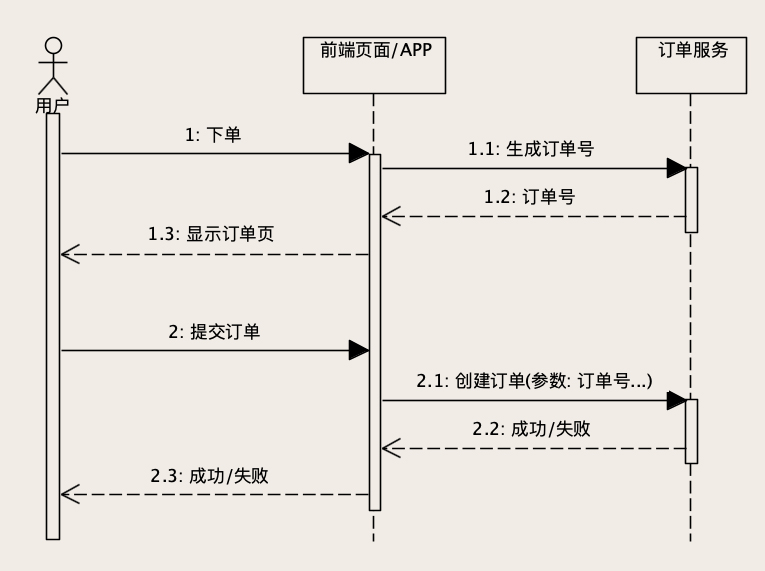
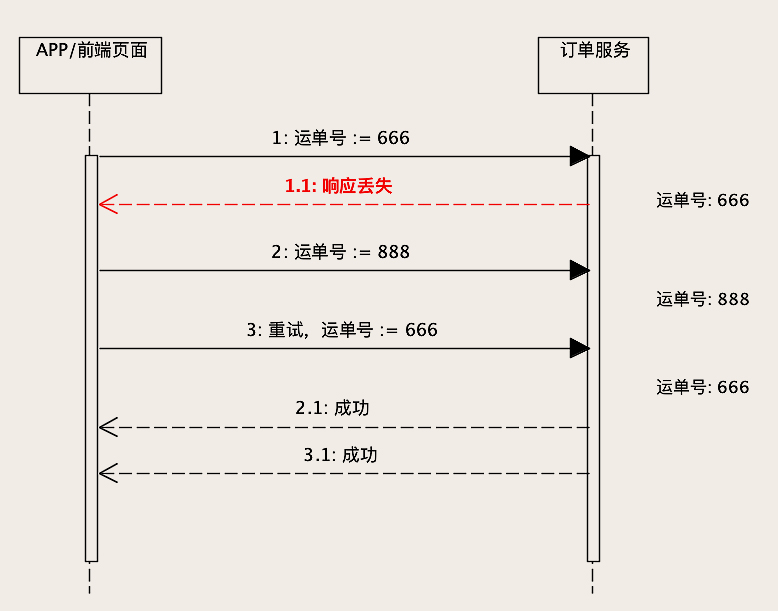
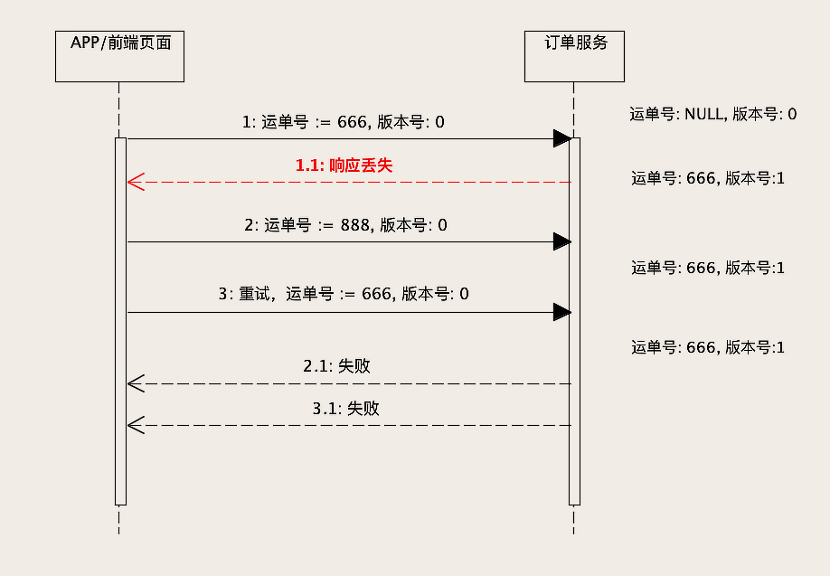
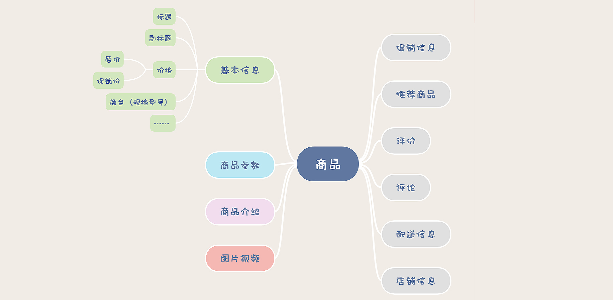
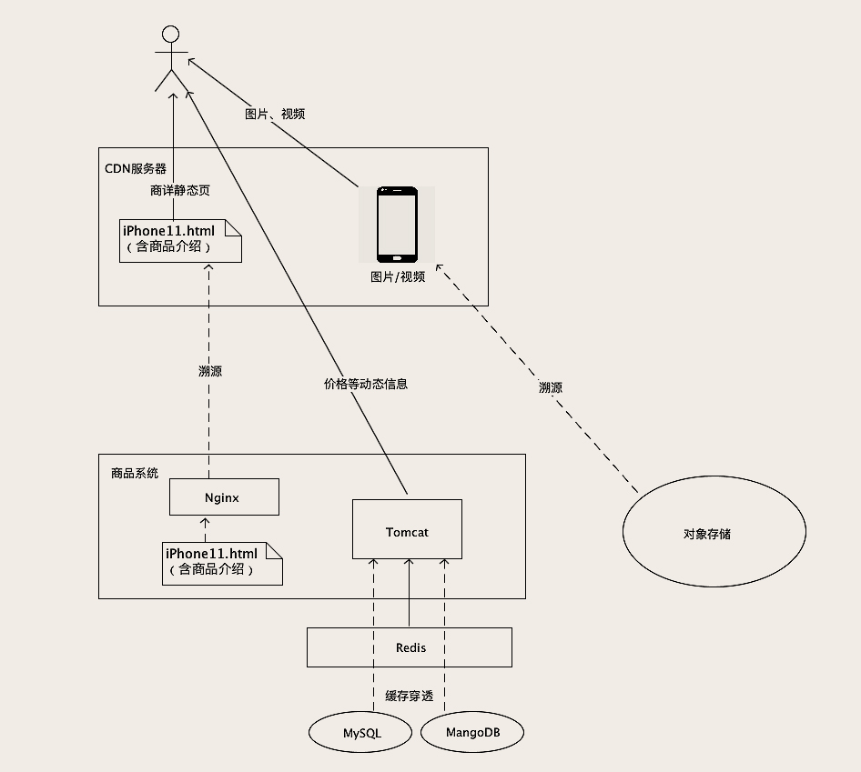

```json
{
  "updated_by": "KelipuTe",
  "updated_at": "2020-07-02",
  "tags": "极客时间,后端存储实践课"
}
```

---

### 创建和更新订单时，如何保证数据准确无误？

一个合格的订单系统，最基本的要求是**数据不能错**。要达到目的其实并不难，首先保证代码没有 Bug ，然后正确的使用数据库的事务，最后注意细节。

#### 如何避免重复下单？

让订单服务具备**幂等性**可以避免重复下单。幂等操作的特点是，其任意多次执行所产生的影响均与一次执行的影响相同。一个幂等的创建订单服务，无论创建订单的请求发送多少次，数据库都只有一条新创建的订单记录。

可以利用数据库的**唯一约束**特性，在插入数据的时候带上**唯一识别码**，来解决创建订单服务的幂等性问题。具体的做法是给订单系统增加一个生成订单号的服务，这个服务没有参数，返回值就是一个新的、全局唯一的订单号。在用户进入创建订单的页面时，前端页面先调用这个生成订单号服务得到一个订单号，在用户提交订单的时候，在创建订单的请求中带着这个订单号。这样，无论是用户手抖，还是各种情况导致的重试，这些重复请求中带的都是同一个订单号。



#### 如何解决 ABA 问题？

假设一个场景。订单支付之后，小二要发货，发货完成后要填个快递单号。小二填了一个单号  666，刚填完，发现填错了，赶紧再修改成 888。正常情况下，订单中的快递单号会先更新成  666，再更新成 888。但是不正常情况下。666 请求到了，单号更新成 666，然后 888 请求到了，单号又更新成 888，但是 666 更新成功的响应丢了，调用方没收到成功响应，自动重试，再次发起 666 请求，单号又被更新成 666  了，这数据显然就错了。



ABA  问题有一个比较通用的解决方法。给订单主表增加一列，列名可以叫  version，也即是**版本号**的意思。每次查询订单的时候，版本号需要随着订单数据返回给页面。页面在更新数据的请求中，需要把这个版本号作为更新请求的参数，再带回给订单更新服务。

订单服务在更新数据的时候，需要比较订单当前数据的版本号，是否和消息中的版本号一致，如果不一致就拒绝更新数据。如果版本号一致，还需要再更新数据的同时，把版本号 +1。比较版本号、更新数据和版本号 +1，这个过程必须在同一个事务里面执行。通过这个版本号，就可以保证，从打开这条订单记录开始，一直到更新这条订单记录成功，这个期间没有其他人修改过这条订单数据。



### 流量大、数据多的商品详情页系统该如何设计？

电商的商品系统主要功能就是增删改查商品信息，没有很复杂的业务逻辑，支撑的主要页面就是商品详情页（下文简称：商详）。不过，设计这个系统的存储，仍然需要着重考虑两个方面的问题。

第一，要考虑**高并发**的问题。不管是什么电商系统，商详页一定是整个系统中 DAU（日均访问次数）最高的页面之一。

第二，要考虑的是商品**数据规模**的问题。商详页的数据规模有数量多，重量大的特点。数量多就是SKU（直译为：库存单元，在电商行业，你可以直接理解为“商品”）多。重量大，可以理解为，商详页里面不光有大量的文字，还有大量的图片和视频，甚至还有 AR/VR 的玩法在里面，也就是说每个商详页上都有大量的数据。

#### 商品系统需要保存哪些数据？

先来看一下，一个商详页都有哪些信息需要保存。



设计一张商品表，把这些这么多内容数据都放进去，一张表存不下就再加几张子表。这个方案是可行的，这么做的好处是简单可靠而且容易实现。但是，撑不了多少数据量，也撑不了多少并发。如果要低成本快速构建一个小规模电商，这么做就是一个挺合理的选择。当然，规模再大一点儿就不能这么干了。不光是数据库，任何一种存储都是没办法满足的，所以这里的解决思路是**分而治之**。

#### 商品基本信息该如何存储？

先来分析商品的基本信息，它包括商品的主副标题、价格、颜色等一些商品最基本、主要的属性。这些属性都是**固定**的，不太可能会因为需求或者不同的商品而变化，而且，这部分数据也不会太大。所以，在数据库中建一张表来保存商品的基本信息。然后，还需要在数据库前面，加一个**缓存**，帮助数据抵挡绝大部分的读请求。这个缓存，可以使用 Redis，也可以用 Memcached，这两种存储系统都是基于内存的 KV 存储，都能解决问题。

处理商品信息的读请求时，先去缓存查找，如果找到就直接返回缓存中的数据。如果在缓存中没找到，再去查数据库，把从数据库中查到的商品信息返回给页面，顺便把数据在缓存里也放一份。更新商品信息的时候，在更新数据库的同时，也要把缓存中的数据给删除掉。不然就有可能出现数据库中的数据变了，而缓存中的数据没变这种情况。这种缓存更新的策略，称为 Cache  Aside，是最简单实用的一种缓存更新策略，适用范围也最广泛。如果你要缓存数据，没有什么特殊的情况，首先就应该考虑使用这个策略。除了 Cache Aside 以外，还有 Read/Write Through、Write Behind 等几种策略，分别适用于不同的情况。

设计商品基本信息表的时候，**一定要记得保留商品数据的每一个历史版本**。因为商品数据是随时变化的，但是订单中关联的商品数据，必须是下单那个时刻的商品数据，这一点很重要。你可以为每一个历史版本的商品数据保存一个快照，可以创建一个历史表保存到 MySQL 中，也可以保存到一些 KV 存储中。

#### 使用 MongoDB 保存商品参数

分析商品参数，参数就是商品的特征。比如说，电脑的内存大小、手机的屏幕尺寸、酒的度数、口红的色号等等。和商品的基本属性一样，都是结构化的数据。但麻烦的是，不同类型的商品，它的参数是完全不一样的。如果我们设计一个商品参数表，那这个表的字段就会太多了，并且每增加一个品类的商品，这个表就要加字段，这个方案行不通。用几十张表分别保存不同品类的商品参数，这样做也是可以的，但是不好。这个时候就需要 使用 NoSQL 数据库。

MongoDB 是一个面向文档存储的 NoSQL 数据库。它最大的特点就是，表结构是不需要事先定义的，其实，在 MongoDB 中根本没有表结构。MongoDB 中的每一行数据，在存储层就是简单地被转化成 BSON 格式后存起来，这个 BSON 就是一种更紧凑的 JSON。所以，即使在同一张表里面，它每一行数据的结构都可以是不一样的。当然，这样的灵活性也是有代价的，MongoDB 不支持 SQL，多表联查和复杂事务比较弱，不太适合存储一般的数据。但是商品参数不需要事务和多表联查。

#### 使用对象存储保存图片和视频

图片和视频由于占用存储空间比较大，一般的存储方式都是，在数据库中只保存图片视频的 ID 或者 URL，实际的图片视频以文件的方式单独存储。首选的方式就是保存在对象存储（Object Storage）中。各大云厂商都提供对象存储服务，比如国内的七牛云、AWS 的 S3 等等，也有开源的对象存储产品，比如 MinIO，可以私有化部署。

对象存储可以简单理解为一个无限容量的大文件 KV 存储，它的存储单位是对象，其实就是文件。每个对象都有一个唯一的 key，利用这个 key 就可以随时访问对应的对象。基本的功能就是写入、访问和删除对象。访问图片视频的时候，真正的图片和视频文件也不需要经过商品系统的后端服务，页面直接通过对象存储提供的 URL 来访问，又省事儿又节约带宽。而且，几乎所有的对象存储云服务都自带 CDN（Content Delivery  Network）加速服务，响应时间比直接请求业务的服务器更短。

#### 将商品介绍静态化

商品介绍在商详页中占得比重是最大的，包含了大量的带格式文字、图片和视频。其中图片和视频自然要存放在对象存储里面，商品介绍的文本，一般都是随着商详页一起静态化，保存在 HTML 文件中。

静态化是相对于动态页面来说的。一般我们部署到 Tomcat 中的 Web 系统，返回的都是动态页面，也就是在 Web 请求时，动态生成的。比如说商详页，一个 Web 请求过来，带着  SKUID，Tomcat  中的商详页模块，再去访问各种数据库、调用后端服务，动态把这个商详页拼出来，返回给浏览器。不过，现在基本上没有系统会这么干了，对于每个  SKU 的商详页，你每次动态生成的页面内容是完全一样的。生成这么多次，不仅浪费服务器资源，速度还慢，关键问题是，Tomcat  能能抗的并发量和 Nginx  完全不是一个数量级的。商详页的绝大部分内容都是商品介绍，它是不怎么变的。那不如就把这个页面事先生成好，保存成一个静态的  HTML，访问商详页的时候，直接返回这个 HTML。这就是静态化。

商详页静态化之后，不仅仅是可以节省服务器资源，还可以利用 CDN  加速，把商详页放到离用户最近的 CDN  服务器上，让商详页访问更快。至于商品价格、促销信息等这些需要频繁变动的信息，不能静态化到页面中，可以在前端页面使用 AJAX  请求商品系统动态获取。这样就兼顾了静态化带来的优势，也能解决商品价格等信息需要实时更新的问题。

#### 最后商品系统的存储绘制成下面这张图



## 参考

[极客时间 -- 后端存储实践课](https://time.geekbang.org/column/intro/287)