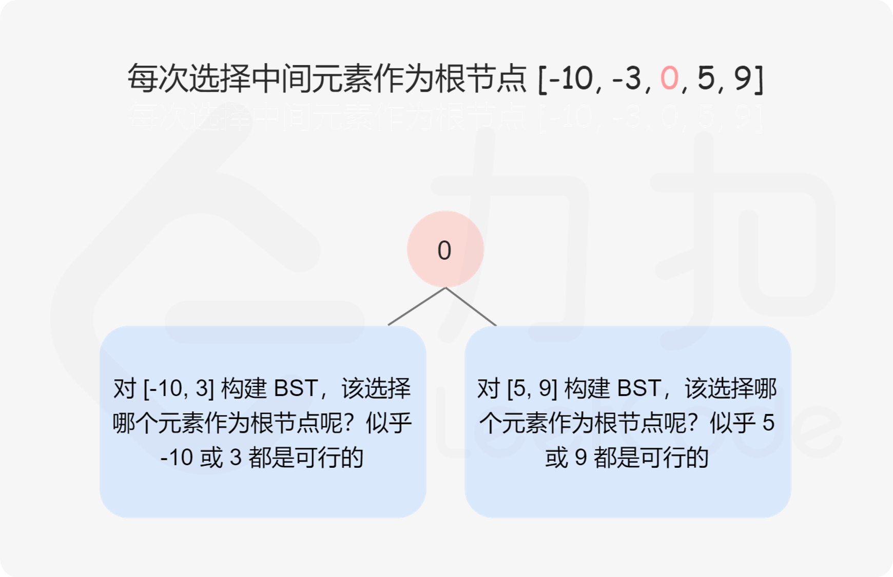

```json
{
  "updated_by": "KelipuTe",
  "updated_at": "2020-07-03",
  "tags": "LeetCode,算法,二叉树"
}
```

---

## 108. 将有序数组转换为二叉搜索树

#### 问题描述

将一个按照升序排列的有序数组，转换为一棵高度平衡二叉搜索树。

本题中，一个高度平衡二叉树是指一个二叉树每个节点 的左右两个子树的高度差的绝对值不超过 1。

示例：
```
给定有序数组: [-10,-3,0,5,9],

一个可能的答案是：[0,-3,9,-10,null,5]，它可以表示下面这个高度平衡二叉搜索树：

      0
     / \
   -3   9
   /   /
 -10  5
```
#### 问题分析

二叉搜索树的中序遍历是升序序列。但是给定二叉搜索树的中序遍历，不能唯一确定二叉搜索树。


增加一个限制条件，即要求二叉搜索树的高度平衡也不能不能唯一确定二叉搜索树。


直观地看，我们可以选择中间数字作为二叉搜索树的根节点，这样分给左右子树的数字个数相同或只相差 1，可以使得树保持平衡。如果数组长度是奇数，则根节点的选择是唯一的，如果数组长度是偶数，则可以选择中间位置左边的数字作为根节点或者选择中间位置右边的数字作为根节点，选择不同的数字作为根节点则创建的平衡二叉搜索树也是不同的。

确定平衡二叉搜索树的根节点之后，其余的数字分别位于平衡二叉搜索树的左子树和右子树中，左子树和右子树分别也是平衡二叉搜索树，因此可以通过递归的方式创建平衡二叉搜索树。这种直观想法是正确的，LeetCode_1382.md 给出了正确性证明。也可以去看 LeetCode [1382 官方题解](https://leetcode-cn.com/problems/balance-a-binary-search-tree/solution/jiang-er-cha-sou-suo-shu-bian-ping-heng-by-leetcod/)。



复杂度分析

时间复杂度：$O(n^3)$，其中 n 是数组的长度。每个数字只访问一次。

空间复杂度：$O(\log n)$，其中 n 是数组的长度。空间复杂度不考虑返回值，因此空间复杂度主要取决于递归栈的深度，递归栈的深度是 $O(\log n)$。

#### PHP 代码实现

ErChaShu.php 见 ErChaShu.md 的内容。

```php
/**
 * Definition for a binary tree node.
 * class TreeNode {
 *     public $val = null;
 *     public $left = null;
 *     public $right = null;
 *     function __construct($value) { $this->val = $value; }
 * }
 */

require_once 'ErChaShu.php';

/**
 * @param Integer[] $nums
 * @return TreeNode
 */
function sortedArrayToBST($nums)
{
    return makeBST($nums, 0, count($nums) - 1);
}

function makeBST($nums, $left, $right)
{
    if ($left > $right) return null;
    $mid = intval(($left + $right) / 2);
    $treeNode = new TreeNode($nums[$mid]);
    $treeNode->left = makeBST($nums, $left, $mid - 1);
    $treeNode->right = makeBST($nums, $mid + 1, $right);

    return $treeNode;
}
```

测试代码：

```php
$testList = [
    [],
    [0],
    [4, 8],
    [4, 6, 8],
    [-9, 4, 6, 8],
    [-10, -3, 0, 5, 9]
];
$resultList = [];

$timeStart = intval(microtime(true) * 1000);
foreach ($testList as $item) {
    $resultList[] = sortedArrayToBST($item);
}
$timeStop = intval(microtime(true) * 1000);

$echo = [
    'timeStart' => $timeStart,
    'timeStop' => $timeStop,
    'timePass' => ($timeStop - $timeStart),
    'resultList' => $resultList
];
echo json_encode($echo);
```

#### 测试结果

执行结果：通过

执行用时：12 ms, 在所有 PHP 提交中击败了100.00% 的用户

内存消耗：18.3 MB, 在所有 PHP 提交中击败了100.00% 的用户

## 参考来源

#### [108. 将有序数组转换为二叉搜索树](https://leetcode-cn.com/problems/convert-sorted-array-to-binary-search-tree/)