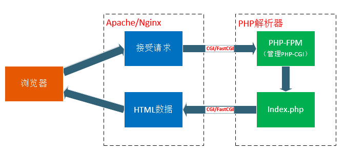

```json
{
  "title": "CGI,FastCHI,PHP-CGI,PHP-FPM 的关系",
  "updated_at": "2020-06-20",
  "updated_by": "KelipuTe",
  "tags": "PHP"
}
```

---

## CGI,FastCHI,PHP-CGI,PHP-FPM 的关系

#### 问题背景

想要了解 CGI,FastCHI,PHP-CGI,PHP-FPM 的关系，首先需要了解一些 Web 服务的基础知识。

在 Web 服务中，Web Server 一般指 Apache、Nginx、Tomcat、IIS、Lighttpd 等服务器，Web Application 一般指 PHP、Java、.NET 等应用程序。

在整个网站架构中，Web Server（Apache,Nginx）只是内容的分发者。

举个例子，如果客户端请求的是 index.html，那么 Web Server 会去文件系统中找到这个文件，发送给浏览器，这里分发的是静态数据。


如果请求的是 index.php，根据配置文件，Web Server 知道这个不是静态文件，需要去找 PHP 解析器来处理，那么他会把这个请求简单处理，然后交给PHP解析器。



当 Web Server 收到 index.php 这个请求后，会启动对应的 CGI  程序，这里就是 PHP 的解析器。

接下来 PHP 解析器会解析 php.ini 文件，初始化执行环境，然后处理请求，再以规定 CGI 规定的格式返回处理后的结果，退出进程，Web Server 再把结果返回给浏览器。

这就是一个完整的动态 PHP Web 访问流程，接下来再引出这些概念，就好理解多了。

#### CGI,FastCHI,PHP-CGI,PHP-FPM

CGI：全称通用网关接口（Commom Gateway Interface）。是 Web Server 与 Web Application 之间数据交换的一种协议。

FastCGI：是 CGI 的升级版本，FastCGI 可以看成是一个常驻型的 CGI。同 CGI，是一种通信协议，但比 CGI 在效率上做了一些优化。同样，SCGI 协议与 FastCGI 类似。

PHP-CGI：是 PHP （Web Application）对 Web Server 提供的 CGI 协议的接口程序。

PHP-FPM：全称 PHP FastCGI 进程管理器（FastCGI Process Manager）。是 PHP（Web Application）对 Web Server 提供的 FastCGI 协议的接口程序，额外还提供了相对智能一些任务管理。

CLI：别和上面的 CGI 混淆了，CLI 是 PHP 的命令运行模式。

#### Module 方式

在了解 CGI 之前，我们先了解一下 Web Server 传递数据的另外一种方法：PHP Module 加载方式。

以 Apache 为例，使用 PHP Module 方式时，在 Apache 的配置文件 httpd.conf 中，会作出如下修改：

```
# 修改
<IfModule dir_module>
    DirectoryIndex index.html index.php
</IfModule>

# 添加
<IfDefine php7.2>
    PHPIniDir "E:\PHP\php-7.2.31"
    LoadModule php7_module "E:\PHP\php-7.2.31\php7apache2_4.dll"
    AddType application/x-httpd-php .php .html .htm
</IfDefine>
```

这么做的目的是，把 PHP 作为 Apache 的一个子模块来运行。当通过 Web 访问 PHP 文件时，Apache 就会调用 php7_module 来解析 PHP 代码。php7_module 通过 SAPI 来将数据传给 PHP 解析器来解析 PHP 代码。

SAPI，即是 Server Application Programming Interface 的首字母缩写，意思是服务器端应用编程接口。这是 PHP 内核提供给外部调用其服务的接口，即外部系统可以通过 SAPI 来调用 PHP 提供的编译脚本、执行脚本的服务。PHP 默认提供了很多种 SAPI，常见的提供给 Apache 和 Nginx 的 php7_module、CGI、FastCGI，给 IIS 的 ISAPI，以及 Shell 的 CLI。

下面详细描述 Apache、SAPI、PHP 的关系。


从上图中，可以看出 SAPI 处于中间位置，SAPI 提供了一个和外部通信的接口，使得 PHP 可以和其他应用（Apache，Nginx 等）进行数据交互。在 Apache 中调用 PHP 脚本执行的过程为：Apache => httpd => php7_module => SAPI => PHP。

这种将 PHP 模块安装到 Apache 中的模式，在每一次 Apache 接收请求时，都会产生一个进程来连接 PHP 通过 SAPI 来完成请求，这个进程会完整的包括 PHP 的各种运算计算等操作。这带来一个问题，一旦并发数过多，服务器就会承受不住。

#### CGI

CGI：全称通用网关接口（Commom Gateway Interface），是 Web 服务器与 PHP 应用进行“交谈”的一种工具，是 HTTP 服务器和动态脚本语言间通信的接口或者工具，其程序需要运行在网络服务器上。CGI 可以用任何一种语言编写，只要这种语言具有标准输入、输出和环境变量，如 php、perl、tcl 等。CGI 就是规定要传哪些数据，以及以什么样的格式传递给后方处理这个请求的协议。它规定了 Web 服务器会传哪些数据，如 URL、查询字符串、POST 数据、HTTP HEADER 等 ，给 PHP 解析器。

CGI 就是专门用来和 Web 服务器打交道的。Web 服务器收到用户请求，就会把请求提交给 CGI 程序（如 PHP-CGI），CGI 程序根据请求提交的参数作应处理（解析 PHP），然后输出标准的 html 语句，返回给 Web 服服务器，Web 服务器再返回给客户端，这就是通常的 CGI 的工作原理。

CGI 的好处是完全独立于任何服务器，仅做为中间结构，把动态语言解析和 HTTP 服务器分离开来。提供接口给 Apache 和 PHP。他们通过 CGI 来完成数据传递。这样做的好处是减少了二者的关联，使得二者可以更加独立。但是 CGI 也有一个缺陷，就是每一次 Web 请求都有启动和退出过程，也就是 **fork-and-execute** 模式，一旦并发数过多，就会出问题。

#### FastCGI

FastCGI：是 CGI 的升级版本，本质上和 CGI 是一个差不多的东西。是用来提高 CGI 程序性能的。CGI 解释器的反复加载是 CGI 性能低下的主要原因，如果 CGI 解释器保持在内存中，并接受 FastCGI 进程管理器调度，则可以提供良好的性能。FastCGI 接口方式采用 C/S 架构，分为客户端（HTTP 服务器）和服务端（动态语言解析服务器）。

FastCGI 可以看成是一个常驻（long-live）型的 CGI。激活后，可以一直执行着，不会每次都要花时间去启动一次。

FastCGI 程序也可以和 Web 服务器分别部署在不同的主机上，它还可以接受来自其他 Web 服务器的请求，它可以支持分布式。

FastCGI 是语言无关的。其主要行为是将 CGI 解释器进程保持在内存中并因此获得高效的性能。

FastCGI 进程管理器需要单独启动。启动 FastCGI 后，会生成一个 FastCGI 主进程和多个子进程（子进程其实就是 CGI 解释器进程）。当客户端请求 Web 服务器上的动态脚本时，Web 服务器会将动态脚本通过 TCP 协议交给 FastCGI 主进程，FastCGI 主进程根据情况，安排一个空闲的子进程来解析动态脚本，处理完成后将结果返回给 Web 服务器，Web 服务器再将结果返回给客户端。该客户端请求处理完毕后，FastCGI 子进程并不会随之关闭，而是继续等待主进程安排工作任务。

#### FastCGI 的工作原理


1、Web Server 启动时载入 FastCGI 进程管理器（Apache Module 或 IIS ISAPI 等）。

2、FastCGI 进程管理器先进行自身的初始化，解析配置文件，初始化执行环境，启动一个 FastCGI 主进程。然后启动多个 CGI 解释器子进程（PHP-CGI），并等待来自 Web Server 的连接。与 CGI 模式的区别是，FastCGI 不需要每个请求都重新解析 php.ini、重新载入全部扩展，并重初始化全部数据结构。在 FastCGI 中，这个操作只会在启动 PHP-CGI 时执行一次，然后 PHP-CGI 便会保存在内存中不会退出。但是由于 FastCGI 是多进程的，所以比 CGI 多线程消耗更多的服务器内存。

3、当客户端请求到达 Web Server 时，FastCGI 进程管理器选择并连接到一个 CGI 解释器（即分配一个 PHP-CGI），并将 CGI 环境变量和标准输入发送到 FastCGI 子进程 PHP-CGI 然后立即可以接受下一个请求。这样就避免了只使用 CGI 时重复的启动和退出的问题。而且当子进程 PHP-CGI 不够用时， FastCGI 主进程可以根据配置预先启动几个 PHP-CGI 等着。同理，空闲的子进程 PHP-CGI 太多时，也会停掉一些，这样就提高了性能，也节约了资源。

4、子进程 PHP-CGI 完成处理后，将标准输出和错误信息从同一连接返回 Web Server。当 FastCGI 子进程关闭连接时，请求便处理完成。FastCGI 子进程进入等待状态，等待处理来自 FastCGI 进程管理器的下一个连接。在 CGI 模式中， PHP-CGI 在此时会退出。

#### PHP-FPM

PHP-FPM：全称 PHP FastCGI 进程管理器（FastCGI Process Manager）

PHP-FPM 就是 PHP 中的 FastCGI 进程管理器。PHP-FPM 的管理对象是 PHP-CGI。PHP-FPM 提供了更好的 PHP 进程管理方式，可以有效控制内存和进程、可以平滑重载 PHP 配置。


## 参考

[CGI、FastCGI和PHP-FPM关系详解](https://www.cnblogs.com/zzx-hjl/p/10583849.html)

[PHP中的SAPI是什么？如何实现？（图文）](https://www.php.cn/php-weizijiaocheng-410435.html)

[CGI、FastCGI和php-fpm概念和区别](https://blog.csdn.net/IT_10/article/details/92801153)

[简单了解下CGI、FastCGI和php-fpm的概念和区别和运行原理](https://www.cnblogs.com/wt645631686/p/8065103.html)